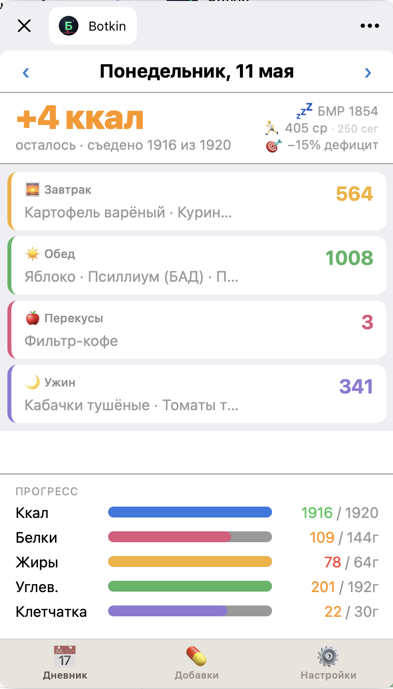
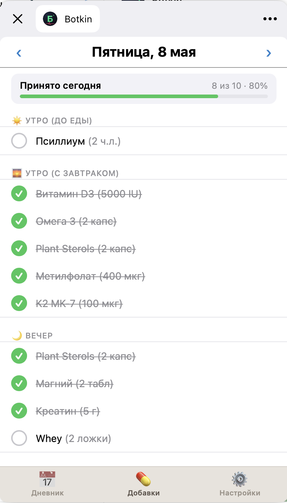

# 📱 Mini-app — экран дневника прямо в Telegram

> Если Telegram-бот — это «быстро записать», то Mini-app — это «увидеть что записано». Открывается прямо внутри Telegram, ничего ставить не надо.

## Как открыть

В чате с [@Botkin_md_bot](https://t.me/Botkin_md_bot):
- Кнопка «📱 Открыть Mini-app» в меню бота
- Или иконка приложения в углу чата (рядом со скрепкой)
- На iPhone — нажми, открывается полноэкранно

## Три вкладки

### 📅 Вкладка «Дневник»

**Что показывает:**
- **Главное число:** сколько съел / сколько осталось от дневной нормы
- **Все приёмы пищи** списком (Завтрак / Обед / Перекусы / Ужин) с калориями каждого
- **Прогресс-бары** по белкам / жирам / углеводам / клетчатке за день
- **Слева сверху**: BMR (минимум для жизни) + средняя активность с твоих часов
- **Стрелки `<` `>`** сверху — листать дни назад/вперёд (хороший способ глянуть прошлую неделю)
- **Дефицит/профицит** — твоя текущая цель и насколько ты в неё попадаешь

Тап на приём пищи → откроется детально, можно отредактировать состав или удалить.

### 💊 Вкладка «Добавки»

**Что показывает:**
- Твои добавки и лекарства **сгруппированы по времени дня:**
  - 🌅 Утро (до еды)
  - 🥣 Утро (с завтраком)
  - 🌇 Вечер
  - 🌙 Ночь
- **Чек-бокс** возле каждого. Тап → отметил «принял» (вычёркивается). Снять тап → отменил.
- **Прогресс-бар сверху**: «Принято сегодня: X из Y · NN%»
- **Стрелки `<` `>`** — листать дни (можно отметить что забыл вчера)

Это **самый удобный способ отметить лекарства за день**:
- Открыл утром → тапнул карипразин / атомоксетин / амантадин / витамин D в один присест
- Вечером ещё раз — два тапа, всё
- Хлорпротиксен на ночь — один тап

### ⚙️ Вкладка «Настройки»

**Что показывает и позволяет менять:**
- **Цели по калориям и БЖУ** — дневная норма, можно подкрутить вручную
- **Список добавок/лекарств** — добавить новую позицию с дозой и слотом приёма; удалить старую
- **Часовой пояс** — критично если ты не в Москве (определяет когда у тебя «сегодня»)
- **Биометрия** — рост, вес, возраст (если меняется)
- **Цель** — похудеть / удержать / набрать (если решил поменять)
- **Уровень активности** — если стал ходить в зал, увеличь
- **Токены** — Apple Health и MCP (см. [Безопасность](./security.md))

## Отличие от Dashboard

| | Mini-app | Dashboard |
|---|---|---|
| Где открывается | Внутри Telegram | В любом браузере (ноут, телефон, планшет) |
| Период данных | 1 день, можно листать | Часто весь временной диапазон, графики |
| Назначение | Быстрая регистрация / отметка | Анализ трендов, биомаркеров, графики |
| Когда удобно | На ходу, в дороге | За компом, вдумчиво |

Подробнее про большую страницу — в [Dashboard](./dashboard.md).

## Технические нюансы

- Mini-app — это [Telegram Web App](https://core.telegram.org/bots/webapps) с твоим персональным session-токеном
- При перезапуске Telegram надо открыть мини-апп ещё раз (она не resident)
- На iPad открывается в маленьком окне (Telegram ограничивает)
- Если что-то не загружается — закрой и открой ещё раз, обычно помогает

## Связанные разделы

- [Telegram-бот](./telegram-bot.md) — как туда записать
- [Dashboard](./dashboard.md) — большая страница
- [Безопасность](./security.md) — токены в настройках
